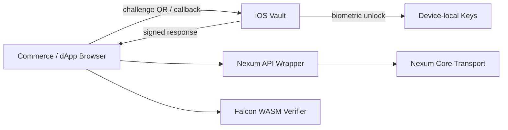

# Nexum Network

Grant-ready project hub for the Nexum Network: post-quantum signing, local vaults, QR challenge flows, and privacy-preserving commerce integrations.

This repository is intentionally a public-facing coordination layer. It does not contain private keys, production secrets, deployment credentials, or unreleased customer data.

## Vision

Nexum Network aims to make strong cryptographic actions usable by ordinary users:

- a user owns keys locally,
- a website or service presents a challenge,
- the user reviews the request on a trusted device,
- the device signs the canonical challenge,
- the service verifies the response without receiving private key material.

The initial focus is a Falcon-based QR signing vault for iOS, a Rust transport layer for secure node flows, and storefront integration patterns for privacy-preserving commerce.

## Current Modules

| Module | Repository | Status |
| --- | --- | --- |
| iOS Vault | https://github.com/lukasz82338233/nexum-vault-ios | Public, CI passing |
| Core / Transport | https://github.com/niirmataa/nexum-core | Public, experimental, needs history sync and audit |
| Falcon Research | https://github.com/niirmataa/free_falcon_sign | Public, research implementation |
| Commerce Integration | https://github.com/niirmataa/e-commerce_shop_v1 | Public, local changes pending commit |
| Falcon WASM | Local workspace only | Candidate package/repo, not published yet |

## Architecture

## Grant Thesis

Most identity and commerce flows still ask users to trust servers with too much authority. Nexum shifts high-value approvals to a device-local signing flow, where the user can inspect a human-readable challenge before signing.

Funding would accelerate:

- a documented QR challenge/response protocol,
- audited canonical JSON signing,
- production-grade mobile key storage,
- open-source verifier libraries,
- repeatable demos for commerce, escrow, and node authorization.

## Near-Term Deliverables

1. Stabilize the public iOS vault repository and release a TestFlight-ready build.
2. Split Falcon WASM into a clean package with reproducible builds.
3. Restore and test the full Rust workspace in `nexum-core`.
4. Convert storefront integration into a minimal public demo.
5. Write a security review checklist before any production deployment.

## Important Security Note

This is not yet production-audited cryptography. Falcon integration, QR payload validation, canonical JSON, key storage, and transport authentication must be reviewed before production use.

See:

- [Security Model](docs/security-model.md)
- [Grant Roadmap](docs/grant-roadmap.md)
- [Repository Map](docs/repository-map.md)
- [Demo Plan](docs/demo-plan.md)
